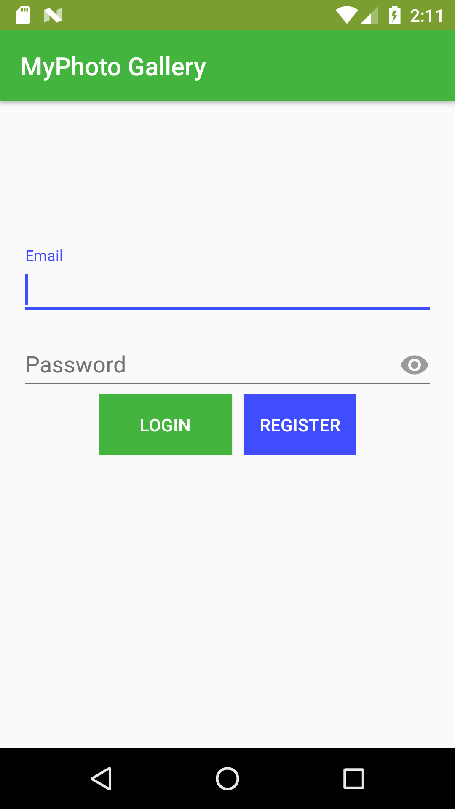
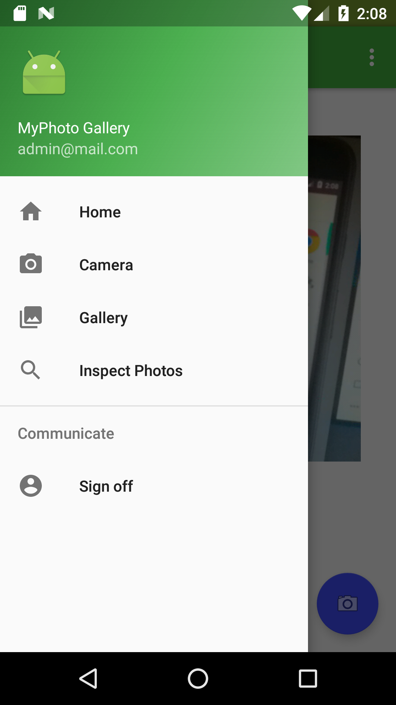
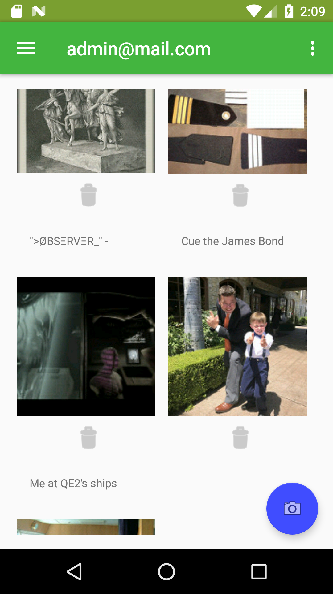
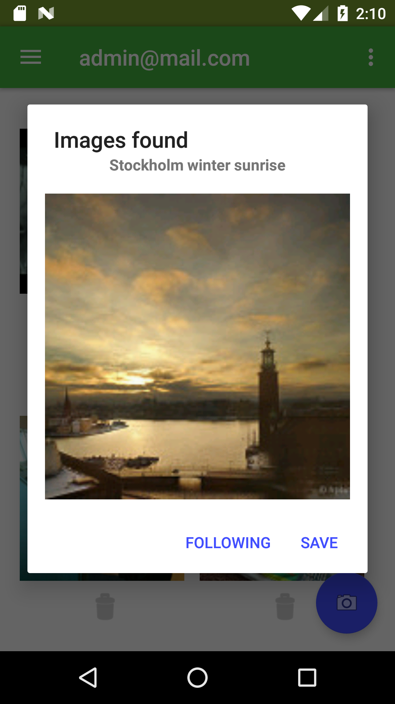

# ProfessionalAndroid_muntasirbillah

####This is the final projet for Professional Android App Development provided by edx.com . This app is a photo management app. 

#Key feature of this app:
#### 1.User can login and register using firebase.
#### 2.User can take photo using camera and save it in gallery.
#### 3.User can search image online using flicker api
#### 4.User can store image url in firebase and load using that url.
#### 5.While making this app MPV and clean architecture is followed.

 Library used:
1.	Glide
2.	Butterknife
3.	Dagger2
4.	Retrofit2
5.	DBFlow
6.	Firebase
7.	GreenRobot Eventbus
8.	Hdodenhof CircleImageView

